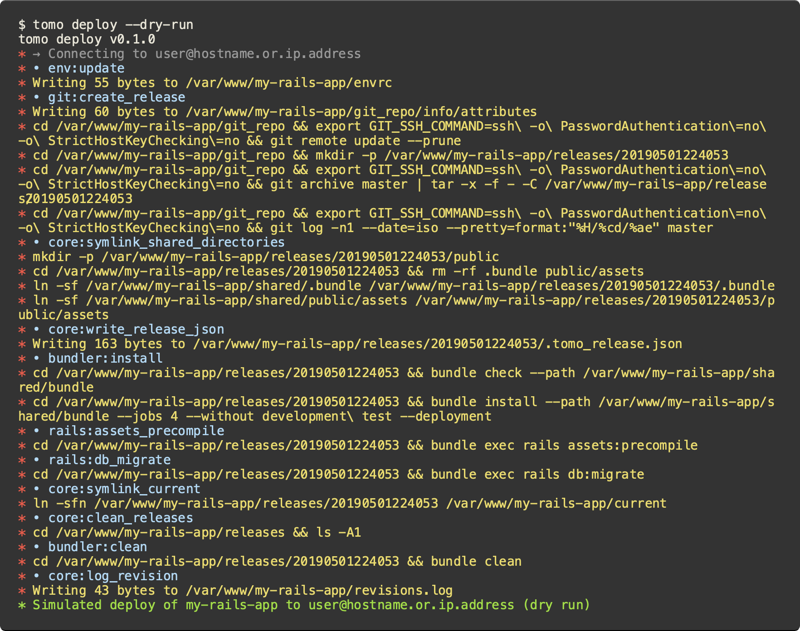

# Tomo

[](https://rubygems.org/gems/tomo)
[](https://travis-ci.org/mattbrictson/tomo)
[](https://codeclimate.com/github/mattbrictson/tomo)
[](https://saythanks.io/to/mattbrictson)

Tomo is a friendly command-line tool for deploying Rails apps. It is a new alternative to Capistrano, Mina, and Shipit that optimizes for simplicity and developer happiness.

💻 Rich command-line interface with built-in bash completions<br/>
☁️ Multi-environment and role-based multi-host support<br/>
💎 Everything you need to deploy a basic Rails app out of the box<br/>
🔌 Easily extensible for polyglot projects (not just Rails!)<br/>
💡 Concise, helpful error messages<br/>
📚 Quality documentation<br/>
🔬 Minimal dependencies<br/>

This project wouldn't be possible without the generosity of the open source Ruby community. Please support open source projects and your fellow developers by helping answer questions, contributing pull requests to improve code and documentation, or just [drop a note](https://saythanks.io/to/mattbrictson) to say thanks! ❤️

---

- [Quick start](#quick-start)
- [Reference documentation](#reference-documentation)
- [FAQ](#faq)
- [Support](#support)
- [License](#license)
- [Code of conduct](#code-of-conduct)
- [Contribution guide](#contribution-guide)

## Quick start

Tomo is distributed as a ruby gem. To install:

```
$ gem install tomo
```

An easy way to kick the tires is to view the `--help`.


Let’s init a project to see how tomo is configured.


The `.tomo/config.rb` file defines all the settings and tasks needed to setup and deploy a typical Rails project. An abbreviated version looks like this:

```ruby
# .tomo/config.rb

plugin "git"
plugin "bundler"
plugin "rails"
# ...

host "user@hostname.or.ip.address"

set application: "my-rails-app"
set deploy_to: "/var/www/%<application>"
set git_url: "git@github.com:my-username/my-rails-app.git"
set git_branch: "master"
# ...

setup do
  run "git:clone"
  run "git:create_release"
  run "bundler:install"
  run "rails:db_schema_load"
  # ...
end

deploy do
  run "git:create_release"
  run "core:symlink_shared_directories"
  run "core:write_release_json"
  run "bundler:install"
  run "rails:assets_precompile"
  run "rails:db_migrate"
  run "core:symlink_current"
  # ...
end
```

Eventually you'll want to edit the config file to specify the appropriate user and host, perhaps define some custom tasks, and tweak the settings to make them suitable for your Rails app. You can also take advantage of more advanced features like multiple hosts and environment-based config. But in the meantime, let's take a look at how the `deploy` command works:


We can simulate an entire deploy with the `--dry-run` option. Let's try it:



Tomo can also run individual remote tasks, which comes in very handy. Use the `tasks` command to see the list of tasks tomo knows about. By the way, it is very easy to write your own tasks to add to this list.


One of the built-in Rails tasks is `rails:console`, which brings up a fully-interactive Rails console over SSH. We can simulate this with `--dry-run` as well.


And just like that, you are now already familiar with the basics of tomo and how it works! Tomo is even more friendly and powerful with the help of bash completions. If you use bash, run `tomo completion-script` for instructions on setting them up.

#### Next steps

To prepare your existing project for a real deploy, check out the sections of the reference documentation on configuration, writing plugins, the setup command, and the deploy command. There is also a tutorial that walks through deploying a new Rails app from scratch. If you have questions, check out the [FAQ](#faq) and [support](#support) notes below. Enjoy using tomo!

## Reference documentation

_TODO_

## FAQ

_TODO_

## Support

Thanks for your interest in Tomo! I use Tomo myself to deploy my own Rails projects and intend to keep this repository working and up to date for the foreseeable future. However Tomo is only a hobby, and as the sole maintainer, my ability to provide support and review pull request is limited and a bit sporadic. My priorities right now are:

1. Improve test coverage
2. Keep the project free of any serious bugs
3. Stay up to date with the latest versions of Ruby and gem dependencies

If you'd like to help by submitting a pull request, that would be much appreciated! Check out the contribution guide to get started.

Otherwise if you want to report a bug, or have ideas, feedback or questions about Tomo, [let me know via GitHub issues](https://github.com/mattbrictson/tomo/issues/new) and I will do my best to provide a helpful answer. Happy hacking! —Matt

## License

The gem is available as open source under the terms of the [MIT License](https://opensource.org/licenses/MIT).

## Code of conduct

Everyone interacting in the Tomo project’s codebases, issue trackers, chat rooms and mailing lists is expected to follow the [code of conduct](https://github.com/mattbrictson/tomo/blob/master/CODE_OF_CONDUCT.md).

## Contribution guide

_TODO_
